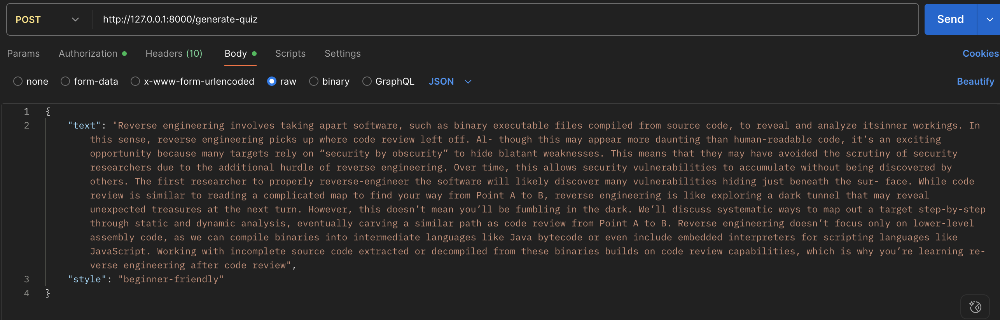
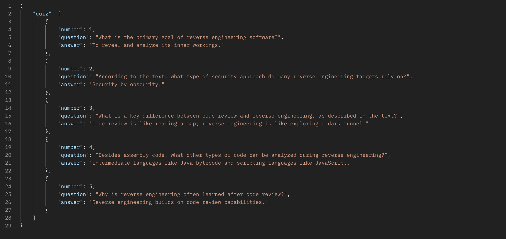

# AI-Enhanced-API - FastAPI Backend


---
## Screenshots





*Example of a generate-quiz endpoint request in Postman*
## Overview

**AI-Enhanced-API** is a FastAPI backend providing multiple AI-powered endpoints using Google's Gemini 2.0 large language model. This toolkit enables you to:

- Summarize text in various styles
- Rephrase text with different tones
- Extract keywords from text
- Generate quizzes based on input content
- Explain terms or paragraphs for different skill levels
- Summarize uploaded documents (PDF or DOCX)

The API is secured with an API key for authorized access.

---

## Features

- **FastAPI backend** with clean, modular endpoints
- Integration with **Google Gemini 2.0 API**
- Document text extraction (PDF and DOCX support)
- Prompt templating from a JSON-based library
- API key authentication for security
- CORS enabled for cross-origin requests

---

## Getting Started

### Prerequisites

- Python 3.9+
- Gemini API key from [Google AI Studio](https://aistudio.google.com/app/apikey)
- API key for your FastAPI app

### Installation

1. Clone the repository

```bash
git clone https://github.com/roxm337/ai-enhanced-api.git
cd ai-enhanced-api


## Setup and Installation

### Create and activate a virtual environment

```bash
python -m venv venv
source venv/bin/activate  # Linux/macOS
venv\Scripts\activate     # Windows
```
### Install dependencies
```bash
pip install -r requirements.txt
```
### Create a .env file in the root directory
```
GEMINI_API_KEY=your_google_gemini_api_key_here
FASTAPI_API_KEY=your_fastapi_access_key_here
```
### Usage

## Run the server locally
```bash
uvicorn main:app --reload
```

### Authentication
All POST endpoints require an API key sent in the request header as:
```bash
x-api-key: your_fastapi_access_key_here
```
## API Endpoints

| Endpoint          | Method | Description                                                        | Auth Required |
|-------------------|--------|--------------------------------------------------------------------|---------------|
| `/`               | GET    | Welcome message                                                   | No            |
| `/summarize`      | POST   | Summarize input text (JSON body: `text`, `style`)                | Yes           |
| `/rephrase`       | POST   | Rephrase text with tone (JSON body: `text`, `tone`)              | Yes           |
| `/extract-keywords`| POST  | Extract keywords from text (JSON body: `text`)                    | Yes           |
| `/generate-quiz`  | POST   | Generate quiz from text (JSON body: `text`, `count`)             | Yes           |
| `/explain`        | POST   | Explain text at a level (JSON body: `text`, `level`)             | Yes           |
| `/summarize-doc`  | POST   | Summarize uploaded PDF or DOCX document (form-data file + optional `style`) | Yes  |

---

## Example Request with `curl`

```bash
curl -X POST http://127.0.0.1:8000/summarize \
-H "Content-Type: application/json" \
-H "x-api-key: your_fastapi_access_key_here" \
-d '{"text": "Artificial intelligence is transforming the world.", "style": "simple"}'

